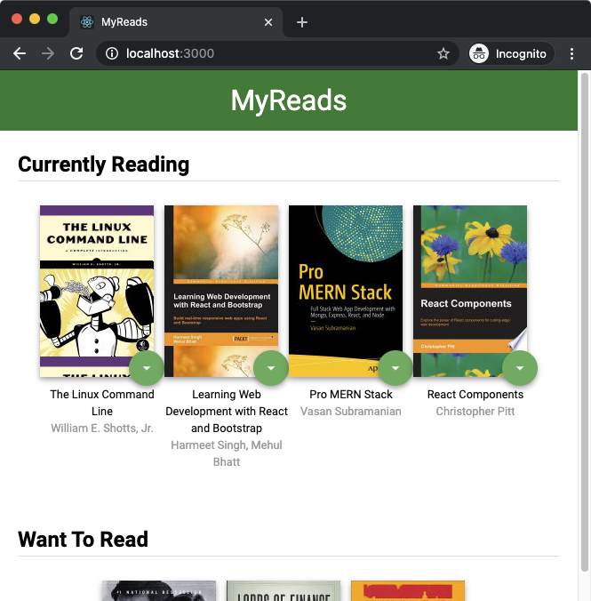

# MyReads Project

A React web application that allows you log books that you have read, are currently reading, or want to read. Part of Udacity's React Developer Programme.

## Instructions
1. Clone the repo or download all the files
2. Assuming you have Node.js installed, navigate to the project folder and install all the dependencies with `npm install`
3. Start the development server with `npm start`

